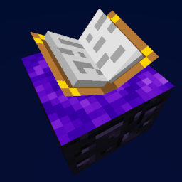
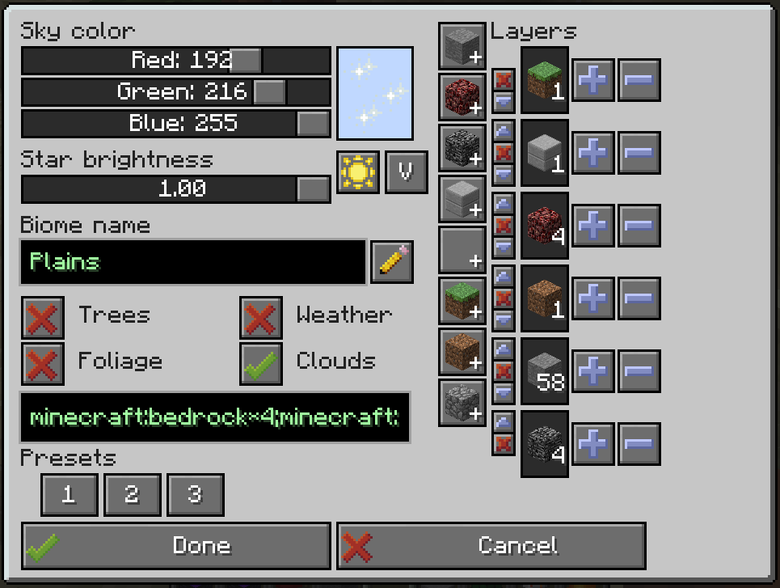

# Personal Space

A Minecraft 1.7.10 mod which adds personal customizable dimensions,
designed for use in the [Gregtech New Horizons](https://github.com/GTNewHorizons/GT-New-Horizons-Modpack) modpack.

There are no recipes for the portal block, they're up to the pack maker to decide - as each portal block can make a new dimension which could lead to server lag if misused.

## Features

 * Customizable personal utility world:
   * Set custom sky color, star brightness - these can be customized after you create your world too if you're not happy with the original settings!
   * Custom generation! Choose from a void, short or tall superflat world preset, or make your own! A list of allowed blocks is in the config, so that players can't just create diamond block worlds on your server.
   * Pick whether you want foliage and trees to spawn or not. (Some modded trees may require extra compatibility code)
   * Migration from UtilityWorlds saves - retaining world generation settings and the look and feel! Feel free to customize the visuals or generation after the fact. Customizing generation requires running the `/pspace allow-worldgen-change DIM` command by a server administrator.
 * Mined portals retain their link and can be placed back
 * Worldgen settings are locked after first use, but can be unlocked for 1 change with `/pspace allow-worldgen-change DIM-ID`
 * Other commands:
   * `/pspace give-portal player DIM [X Y Z]` - gives a preconfigured portal to a given dimension and X/Y/Z coordinates, or dimension spawn point if the coordinates are not specified
   * `/pspace tpx player DIM [X Y Z]` - teleports the player to a given dimension's spawnpoint, or X/Y/Z coordinates
   * `/pspace ls` - list all dimension IDs to the console
   * `/pspace where player` - prints out which dimension ID the player is in
   * `/pspace allow-worldgen-change DIM` - temporarily unlocks editing worldgen settings for the specified dimension

 * Visual (and worldgen if unlocked) settings can be changed on active portals, by right clicking on them while sneaking.

